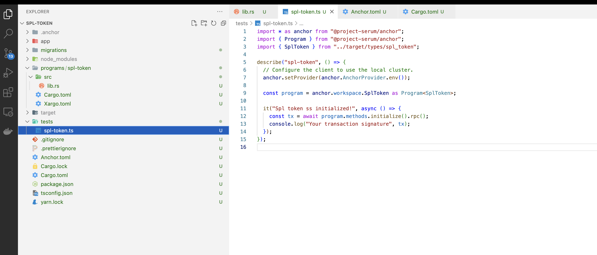
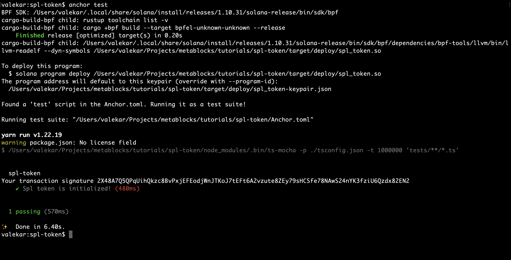

## Outline

Let us continue where we left. In this chapter, we will write a proper test case to test the `Create Mint` instruction. The final result can be referred [here](https://github.com/metablockshq/spl-token-chapters/tree/main/Chapter%204%20-%20Create%20Mint%20with%20Test%20Case)

```bash
anchor test
```

The `anchor test` command does the following operations

1. It runs `cargo build-bpf` command to generate `bytecode` of the program
2. It generates Interface Definition Language(IDL) as.
3. It runs `ts-mocha` command to run the test written in `spl-token.ts` file. 

We will write `tests` for calling the the `create_mint` instruction in the following file 



**Note: This is same as calling an instruction from the client side.** 

### Step-1: Preparations

1. In the `context` struct we are creating two PDA accounts(`spl_token_mint` and `vault`). Hence on the client side, we need to find PDAs for these two accounts, to pass these as arguments while calling the `create_mint` instruction.

Import the necessary libraries in the `spl-token.ts` test file.

```typescript
import * as anchor from "@project-serum/anchor";
import { Program, Provider } from "@project-serum/anchor";
import { SplToken } from "../target/types/spl_token";
import { PublicKey, SystemProgram } from "@solana/web3.js";
import {TOKEN_PROGRAM_ID} from "@solana/spl-token";
import idl from "../target/idl/spl_token.json"; // this generated when we run anchor test command
import { assert } from "chai";
```

2. Then we will find two PDA addresses like below

```typescript
// pda for spl-token-mint account
export const findSplTokenMintAddress = async () => {
  return await PublicKey.findProgramAddress(
    [Buffer.from("spl-token-mint")],
    new PublicKey(idl.metadata.address)
  );
};

// pda for vault account
export const findVaultAddress = async () => {
  return await PublicKey.findProgramAddress(
    [Buffer.from("vault")],
    new PublicKey(idl.metadata.address)
  );
};
```

3. Add some `sols` before calling the instruction. Hence, let's call the below method before calling any instructions in the `spl-token.ts` test file. 

```typescript
export const addSols = async (
  provider: Provider,
  wallet: anchor.web3.PublicKey,
  amount = 1 * anchor.web3.LAMPORTS_PER_SOL
) => {
  await provider.connection.confirmTransaction(
    await provider.connection.requestAirdrop(wallet, amount),
    "confirmed"
  );
};
```

### Step-2 : Write the test case

First, let us add a `before` block and add some sols to the `payer` wallet.

```typescript
describe("spl-token", () => {
  const provider = anchor.AnchorProvider.env();
  // Configure the client to use the local cluster.
  anchor.setProvider(provider);
  const program = anchor.workspace.SplToken as Program<SplToken>;
  const payer = anchor.web3.Keypair.generate();

  before("Add sols to wallet ", async () => {
    await addSols(provider, payer.publicKey); // add some sols before calling test cases
  });
});
```

And we will call the `create_mint` from the test file like below. 

```typescript
 it("Spl token is initialized!", async () => {
    const [splTokenMint, _1] = await findSplTokenMintAddress();

    const [vaultMint, _2] = await findVaultAddress();

    const tx = await program.methods
      .createMint()
      .accounts({
        splTokenMint: splTokenMint,
        vault: vaultMint,
        payer: payer.publicKey,
        tokenProgram: TOKEN_PROGRAM_ID,
        systemProgram: SystemProgram.programId,
      })
      .signers([payer])
      .rpc();

    const vaultData = await program.account.vault.fetch(vaultMint);

    assert(
      vaultData.splTokenMint.toString() === splTokenMint.toString(),
      "The spl token mint should be same"
    );

    console.log("Your transaction signature", tx);
  });
```

### Step-3 : Run test command again

Run the following command

```bash
anchor test
```

You should be able to see the output as below. Now, we have successfully created a `mint` and tested it out.



Now we are ready to transfer (`MintTo`) the newly created mint to a token account. 
