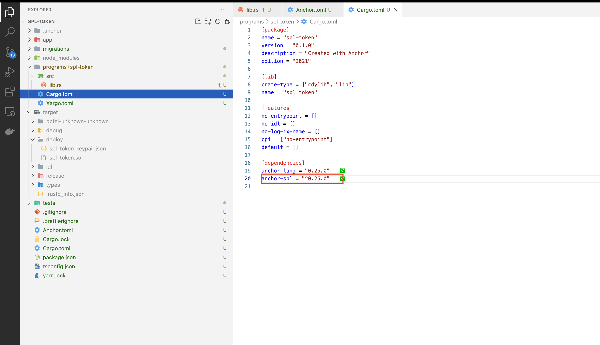
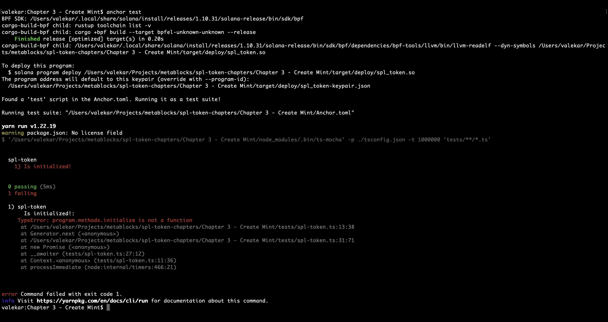

## Outline

In this chapter, we will go through on how to create new mint. The final outcome of this chapter could be found [here](https://github.com/metablockshq/spl-token-chapters/tree/main/Chapter%203%20-%20Create%20Mint)

You could think of `mint` as a metadata about a token that is being transferred to an account. A mint could be initialised in a context. In anchor framework the `struct` is passed as a context. 

First let's import `anchor_spl` into the project so that we can create a mint. Add below in your `cargo.toml` file and run `anchor test` or `anchor build` to check if everything is working fine. 

```toml
anchor-spl = "^0.25.0"
```



Generally in Solana, any accounts that involve in the modification of state, are passed from the client side. This is done for parallel execution of programs. Refer [this](https://medium.com/solana-labs/sealevel-parallel-processing-thousands-of-smart-contracts-d814b378192) article from Anatoly Yakovenko  

It becomes easier in to access these `accounts` using anchor framework. Pass these accounts as context parameter to an instruction.

### How to create a CreateMint context ?

A `struct` can be defined as a context in an anchor program. Let us look at how this could be achieved. 

First import the dependencies

```rust
use anchor_lang::prelude::*;
use anchor_spl::token::{Mint, Token};
```

Then, define a context(`struct`) for accessing these instructions. The `CreateMint` struct is decorated with `#[derive(Accounts)]`.  This helps in deserialisation of accounts described in this `struct`

```rust
#[derive(Accounts)]
pub struct CreateMint<'info> {
    #[account(
        init,
         seeds = [
            b"spl-token-mint".as_ref(),
         ],
        bump,
        payer = payer,
        mint::authority = payer,
        mint::decimals = 0,
        mint::freeze_authority = payer
    )]
    pub spl_token_mint: Account<'info, Mint>, // ---> 1

    #[account(mut)]
    pub payer: Signer<'info>, // ---> 2

    pub system_program: Program<'info, System>, // ---> 3
    pub token_program: Program<'info, Token>,   // ---> 4
    // this is required for spl token mint
    pub rent: Sysvar<'info, Rent>, // ---> 5

    #[account(
        init, 
        space = 8 + Vault::LEN,
        seeds = [
            b"vault"
        ],
        bump,
        payer = payer 
    )]
    pub vault : Account<'info, Vault>, // ---> 6
}
```

In the above code, 6 accounts are passed.

1. An `spl_token_mint` account is created. In Solana, it is recommended to derive the account addresses using Program Derived Addresses (PDA). They are a deterministically generated address based on the program ID. Please refer [this](https://www.brianfriel.xyz/understanding-program-derived-addresses/) to know more about PDAs. We setting other metadata fields like `mint::authority` and `mint::freeze_authority` to `payer`. We are setting `mint::decimals` to `0` for easy demonstration purpose. You could set the value to any number as you like-to.

2. `payer` is the one who is paying for calling `create_mint` instruction. The account is a `signer` account and is set to `mut`.
3. We must pass `system_program` as well while invoking any instruction in solana program. This helps creating accounts. Refer [this](https://docs.solana.com/developing/runtime-facilities/programs#system-program) to know more.   
4. `token_program` account is for interacting with `token-program`.
5. `rent` account is used by `token-program` during mint account creation.
6. `vault` account is a PDA generated account. It is used for storing the state of the program. `Vault` struct is passed into the account generic where actual state is stored. We will have to pass in the space as well. To calculate the space for storing please refer [this](https://book.anchor-lang.com/anchor_references/space.html).

We are passing `Vault` with `vault` account. To store the state of a program, a `struct` could be defined as follows

```rust
// Store the state 
#[account]
pub struct Vault {
    bump : u8, //1
    spl_token_mint_bump:u8, // 1
    authority : Pubkey, //32
    spl_token_mint : Pubkey //32
}

impl Vault {
    pub const LEN: usize =1 + 1 + 32 + 32;
}
```

The `Vault` struct stores bumps and authority of who initialised this program. Later, you can use this to secure your program by restricting the access to the instructions. Stored `bumps` are used later for deriving `PDA` addresses in other instructions.

### How to create an instruction?

Above created `context` is passed as an argument to an instruction. An instruction is a function where we could achieve a set of described procedure. This is usually a state change in the Solana blockchain. Any executed instruction is [Turing](https://en.wikipedia.org/wiki/Turing_completeness#:~:text=In%20colloquial%20usage%2C%20the%20terms,purpose%20computer%20or%20computer%20language) complete.

Let us create an instruction which accepts the `context` as a parameter.

```rust
 pub fn create_mint(ctx: Context<CreateMint>) -> Result<()> {
      let vault = &mut ctx.accounts.vault;
      vault.authority = ctx.accounts.payer.key();
      vault.spl_token_mint_bump = *ctx.bumps.get("spl_token_mint").unwrap();
      vault.bump = *ctx.bumps.get("vault").unwrap();
      vault.spl_token_mint = ctx.accounts.spl_token_mint.key();

      Ok(())
 }
```

In the instruction above, we are storing the `bumps` and other state values into the `Vault` state. 

Now let us run the below command

```bash
anchor test
```

Now should see an error in the output. Like below.



Let's fix this in the next chapter
